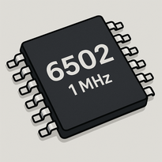

# Helios
Day 5 release for Open Source Week! 

Fully featured 8 bit game console with the following features:

- Custom Assembler
- Custom ISA (Similar to 6502 assembly)
- Custom 8 bit CPU
- Custom Audio drivers with 4 8 bit audio channels
- Future games incoming!

## Table of contents:

1. [The CPU](#Helios-CPU)
2. [The RAM](#Helios-RAM)
3. [The Screen](#Helios-Visual-Engine)
4. [The Audio](#Helios-Audio-Engine)
5. [The ISA](#Helios-ISA)
6. [Contributing](#Contributing)
7. [Future Improvements](#Future-Improvements)
   
## Helios-CPU

Clock speed: **1 MHz**
X and Y 8 bit registers
Fully functional CPU flags

## Helios-RAM

28 KB of usable RAM in a 64 KB address space (0x0000 - 0xFFFF) *With some unallocated parts
Special double buffer memory space (0xF000-0xFC00) and Audio buffering section in RAM. (0xFC00 - 0xFFFF)

## Helios-Visual-Engine
Display size of 256x256 (1:1 aspect ratio)
Maximum color pallete of 8 colors at any time.
Display is rendered at 60 FPS with a double buffer (Screen only needs to be drawn at 30 fps)

## Helios-Audio-Engine
64 indivisual frequencies 21-85 (A0-C#6 on the MIDI scale)
4 channels of Audio
Channel 0: Sine
Channel 1: Square
Channel 2: Triangle
Channel 3: Noise

## Helios-Assembler
Helios comes with an assembler for it's own custom ISA. The assembly time is extremely fast (under 10ms) due to it's simplicity over modeern x86 assembly machines. 

Helios currently supports the following Addressing modes:

| Type of Addressing Mode | Supported? |
|-------------------------|------------|
| Immediate               | Yes!       |
| Zero-page               | Yes!       |
| Absolute                | Yes!       |
| Relative                | No         |
| Indirect                | No         |

Helios also now supports writing labels in assembly and jumping between labels.
Read some example ROMs in the ``roms`` directory

## Helios-ISA

Helios comes with a 6502 inspired instruction set architecture. Here is a long list of all instructions currently implemented.

| Instruction | OPCODE |
|-------------|--------|
| LDA_IMM     | 0xA9   |
| LDA_ZP      | 0xA5   |
| LDA_ZPX     | 0xB5   |
| LDA_ABS     | 0xAD   |
| LDX_IMM     | 0xA2   |
| LDY_IMM     | 0xA0   |
| STA_ZP      | 0x85   |
| STA_ZPX     | 0x95   |
| STA_ABS     | 0x8D   |
| STX_ZP      | 0x86   |
| STY_ZP      | 0x84   |
| TAX         | 0xAA   |
| TAY         | 0xA8   |
| TXA         | 0x8A   |
| TYA         | 0x98   |
| ADC_IMM     | 0x69   |
| SBC_IMM     | 0xE9   |
| AND_IMM     | 0x29   |
| ORA_IMM     | 0x09   |
| EOR_IMM     | 0x49   |
| INC_ZP      | 0xE6   |
| DEC_ZP      | 0xC6   |
| INX         | 0xE8   |
| INY         | 0xC8   |
| DEX         | 0xCA   |
| DEY         | 0x88   |
| CMP_IMM     | 0xC9   |
| CPX_ZP      | 0xE0   |
| CPY_ZP      | 0xC0   |
| JMP_ABS     | 0x4C   |
| JSR_ABS     | 0x20   |
| RTS         | 0x60   |
| BEQ         | 0xF0   |
| BNE         | 0xD0   |
| BCS         | 0xB0   |
| BCC         | 0x90   |
| BMI         | 0x30   |
| BPL         | 0x10   |
| NOP         | 0xEA   |
| BRK         | 0x00   |
| HLT         | 0xFF   |
| DBG         | 0xDE   |
| SND         | 0x42   |

Note: Some of these instructions are custom like DBG and SND.

### DBG
DBG (Debug) is an instruction which accepts an absolute memory address and will print the value at that memory address into stdout to be debugged.
This instruction does not have any other address modes

### SND
SND (Sound) is an instruction which accepts an immediete value to be added into the audio buffer. The 8 bit value should follow the correct audio bit convention shown [Here](#Helios-Audio-Engine)
This instruction does not have any other address modes

## Contributing

Helios was released as the day **5** submission to Open Source Week. I could not be any more greatful to those who decisde to submit bug fixes or new features in pull requests. Please, by all means, contribute your code to this repository to improve the project! 

## Future-Improvements

Some things I did not have the time to implement but i plan to implement in the future are:

- Keyboard input
- Game library
- Save states
- More custom utility instructions in the ISA
- Tools for converting MP3 audio into tracked audio
- Performance improvements

-----
THANK YOU FOR ALL YOUR SUPPORT!
